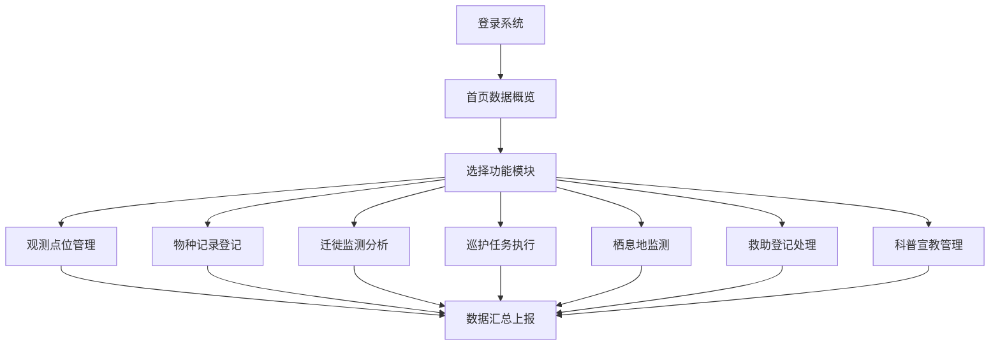

## 1. 产品概述

候鸟保护区监测客户端软件是面向自然保护区管理机构的综合性监测管理平台，服务于保护区日常观测、巡护、救助等核心业务。

- **主要目的**：提升保护区信息化管理水平，实现鸟类观测、巡护管理、栖息地监测、救助登记等业务的数字化、可视化管理
- **目标用户**：保护区管理人员、科研人员、巡护员、科普工作人员
- **产品价值**：通过数据驱动的精细化管理，提高保护区管理效率，为候鸟保护决策提供科学依据

## 2. 核心功能

### 2.1 用户角色

| 角色 | 登录方式 | 核心权限 |
|------|----------|----------|
| 管理员 | 账号密码登录 | 全部模块管理、用户管理、数据导出 |
| 巡护员 | 账号密码登录 | 巡护管理、观测记录、救助登记 |
| 科研人员 | 账号密码登录 | 物种记录、迁徙监测、数据分析 |
| 科普人员 | 账号密码登录 | 科普宣教、数据上报 |

### 2.2 功能模块

1. **观测点位**：观测站点分布地图、站点信息管理、设备状态监控
2. **物种记录**：鸟类物种名录、观测记录、环志回收管理
3. **迁徙监测**：迁徙节律分析、迁徙路线追踪、高峰期预警
4. **巡护管理**：巡护路线轨迹、巡护任务管理、盗猎防控记录
5. **栖息地**：湿地水位管理、栖息地修复项目、环境监测数据
6. **救助登记**：伤病鸟救助记录、治疗跟踪、放归登记
7. **科普宣教**：观鸟科普知识、监测数据上报、宣传素材管理

### 2.3 页面详情

| 页面名称 | 模块名称 | 功能描述 |
|----------|----------|----------|
| 首页概览 | 数据仪表盘 | 保护区整体数据统计、关键指标展示、近期活动提醒 |
| 观测点位 | 站点分布地图 | 地图展示所有观测站点、站点详情弹窗、设备状态图例 |
| 观测点位 | 站点管理 | 站点列表、新增/编辑站点、设备绑定 |
| 物种记录 | 物种名录 | 鸟类物种分类列表、物种详情卡片、检索筛选 |
| 物种记录 | 观测记录 | 观测时间线、记录表单、照片上传 |
| 物种记录 | 环志回收 | 环志编号管理、回收记录、溯源查询 |
| 迁徙监测 | 节律分析 | 迁徙季节图表、物种迁徙时间轴、数据统计 |
| 迁徙监测 | 路线追踪 | 迁徙路线地图、途经站点、飞行轨迹动画 |
| 巡护管理 | 路线轨迹 | 巡护路线地图、轨迹回放、里程统计 |
| 巡护管理 | 任务管理 | 巡护任务列表、任务分配、完成状态 |
| 巡护管理 | 盗猎防控 | 防控记录、案件登记、巡逻日志 |
| 栖息地 | 水位管理 | 水位监测图表、水位预警、历史数据 |
| 栖息地 | 修复项目 | 修复项目列表、进度跟踪、成效评估 |
| 救助登记 | 救助记录 | 伤病鸟救助登记表、物种鉴定、伤情描述 |
| 救助登记 | 治疗跟踪 | 治疗日志、康复状态、照片记录 |
| 救助登记 | 放归登记 | 放归信息、放归地点、健康评估 |
| 科普宣教 | 观鸟科普 | 科普文章列表、鸟类图鉴、知识问答 |
| 科普宣教 | 数据上报 | 上报表单、上报记录、状态查询 |

## 3. 核心流程

### 3.1 主要用户流程

用户登录系统后，根据角色权限进入相应功能模块。巡护员执行巡护任务并记录观测数据，科研人员分析物种和迁徙数据，管理人员统筹全局数据。数据从采集到分析形成闭环，为保护区管理提供决策支持。

### 3.2 核心业务流程

## 4. 用户界面设计

### 4.1 设计风格

- **主色调**：深青绿色（#0F766E），体现自然生态、湿地保护的主题
- **辅助色**：暖橙色（#F59E0B）用于强调和提示，天蓝色（#38BDF8）用于数据可视化
- **背景色**：浅灰绿色渐变背景，营造自然清新的氛围
- **按钮风格**：圆角矩形按钮，悬停时有微妙的浮起效果和阴影变化
- **字体**：标题使用思源宋体，正文使用思源黑体，兼顾可读性和自然气息
- **布局风格**：左侧导航栏 + 右侧内容区，卡片式内容布局，层次分明
- **图标风格**：线性图标，统一描边粗细，融入自然元素

### 4.2 页面设计概览

| 页面名称 | 模块名称 | UI元素 |
|----------|----------|--------|
| 首页概览 | 数据仪表盘 | 统计卡片、数据图表、活动时间线、快捷入口 |
| 观测点位 | 站点分布地图 | 全屏地图、站点标记、状态图例、搜索筛选、详情侧边栏 |
| 物种记录 | 物种名录 | 分类导航、卡片网格、搜索框、筛选器、详情弹窗 |
| 迁徙监测 | 节律分析 | 时间轴图表、数据表格、物种选择器、统计摘要 |
| 巡护管理 | 路线轨迹 | 地图轨迹、时间轴、播放控制、里程统计卡片 |
| 栖息地 | 水位管理 | 水位曲线图、预警标识、监测站点列表、历史数据 |
| 救助登记 | 救助记录 | 登记表单、时间线、照片墙、状态标签 |
| 科普宣教 | 观鸟科普 | 文章卡片、分类标签、搜索、详情阅读页 |

### 4.3 响应式设计

- 桌面端优先设计，适配1920px及以上分辨率
- 平板端适配：导航栏折叠，内容区自适应调整
- 移动端：底部导航切换，卡片单列布局，地图优化触控操作
- 支持触摸手势：滑动切换、双指缩放地图

### 4.4 数据可视化指导

- 迁徙路线使用动态连接线，带有流动动画效果
- 数据图表使用渐变填充，增强视觉层次感
- 地图使用自然风格底图，站点标记使用不同颜色区分状态
- 时间轴展示采用垂直时间线设计，带有节点动画
- 统计卡片带有微妙的入场动画，数据数字有计数动画效果
