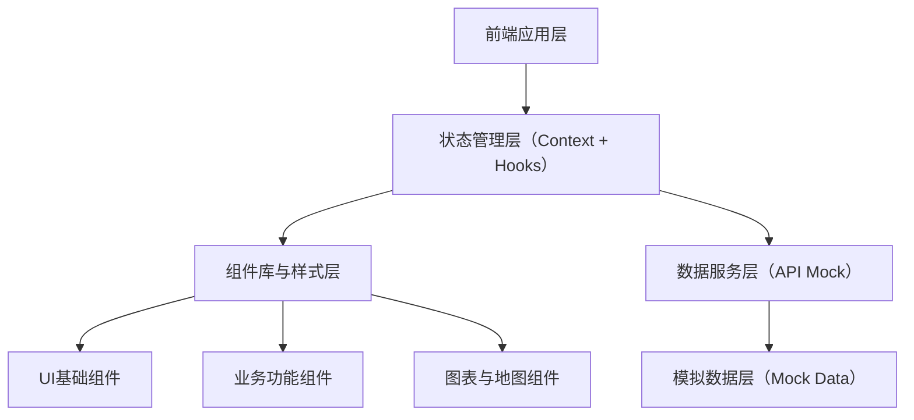
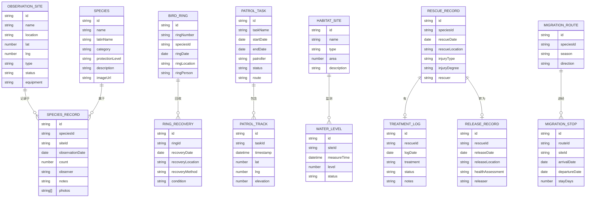

## 1. 架构设计



## 2. 技术说明

- **前端框架**：React@18 + TypeScript
- **构建工具**：Vite@5
- **样式方案**：TailwindCSS@3 + CSS变量
- **路由管理**：React Router@6
- **状态管理**：React Context + useReducer
- **图表库**：Recharts（数据可视化）
- **地图组件**：Leaflet + React-Leaflet（地图展示）
- **图标库**：Lucide React
- **日期处理**：dayjs
- **数据模拟**：MSW 或 本地JSON数据

## 3. 路由定义

| 路由路径 | 页面组件 | 功能说明 |
|----------|----------|----------|
| `/dashboard` | Dashboard | 首页数据概览仪表盘 |
| `/observation/sites` | ObservationSites | 观测点位-站点分布 |
| `/observation/sites/manage` | SiteManagement | 观测点位-站点管理 |
| `/species/directory` | SpeciesDirectory | 物种记录-物种名录 |
| `/species/records` | SpeciesRecords | 物种记录-观测记录 |
| `/species/ringing` | RingingRecovery | 物种记录-环志回收 |
| `/migration/rhythm` | MigrationRhythm | 迁徙监测-节律分析 |
| `/migration/routes` | MigrationRoutes | 迁徙监测-路线追踪 |
| `/patrol/tracks` | PatrolTracks | 巡护管理-路线轨迹 |
| `/patrol/tasks` | PatrolTasks | 巡护管理-任务管理 |
| `/patrol/prevention` | PoachingPrevention | 巡护管理-盗猎防控 |
| `/habitat/water` | WaterManagement | 栖息地-水位管理 |
| `/habitat/restoration` | HabitatRestoration | 栖息地-修复项目 |
| `/rescue/records` | RescueRecords | 救助登记-救助记录 |
| `/rescue/treatment` | TreatmentTracking | 救助登记-治疗跟踪 |
| `/rescue/release` | ReleaseRegistration | 救助登记-放归登记 |
| `/education/birdwatching` | BirdwatchingScience | 科普宣教-观鸟科普 |
| `/education/reporting` | DataReporting | 科普宣教-数据上报 |

## 4. 数据模型

### 4.1 核心数据模型



### 4.2 模块数据结构

#### 观测点位模块
- `ObservationSite`：观测站点信息
- `Equipment`：监测设备信息

#### 物种记录模块
- `Species`：鸟类物种信息
- `SpeciesRecord`：观测记录
- `BirdRing`：环志信息
- `RingRecovery`：环志回收记录

#### 迁徙监测模块
- `MigrationRoute`：迁徙路线
- `MigrationStop`：中途停歇点
- `MigrationRhythm`：迁徙节律数据

#### 巡护管理模块
- `PatrolTask`：巡护任务
- `PatrolTrack`：巡护轨迹点
- `PreventionRecord`：盗猎防控记录

#### 栖息地模块
- `HabitatSite`：栖息地点
- `WaterLevelRecord`：水位记录
- `RestorationProject`：修复项目

#### 救助登记模块
- `RescueRecord`：救助记录
- `TreatmentLog`：治疗日志
- `ReleaseRecord`：放归记录

#### 科普宣教模块
- `ScienceArticle`：科普文章
- `BirdGuide`：鸟类图鉴
- `ReportRecord`：数据上报记录

## 5. 项目结构

```
src/
├── assets/          # 静态资源
├── components/      # 公共组件
│   ├── layout/      # 布局组件
│   ├── ui/          # 基础UI组件
│   └── charts/      # 图表组件
├── pages/           # 页面组件
│   ├── dashboard/   # 首页概览
│   ├── observation/ # 观测点位
│   ├── species/     # 物种记录
│   ├── migration/   # 迁徙监测
│   ├── patrol/      # 巡护管理
│   ├── habitat/     # 栖息地
│   ├── rescue/      # 救助登记
│   └── education/   # 科普宣教
├── data/            # Mock数据
├── hooks/           # 自定义Hooks
├── context/         # Context状态管理
├── utils/           # 工具函数
├── types/           # TypeScript类型定义
├── App.tsx
├── main.tsx
└── index.css
```
